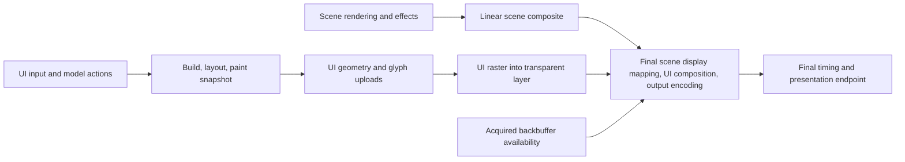

# Custom UI and offscreen composition plan

Status: implementation is on `custom_ui`. Foundation `81481aa88`, GPU composition `37a37a0f6`, Linux OS `b93bace2d`, font/text `1f55b1616`, offline SDF `4cd702d2b`, and interactive foundation `2c7c723ef` are pushed. Main is merged through `c962f5c23` in `d3365b34f`, including its shader compiler refactor. M3 window/separator parity and complete ImGui retirement are pushed in `87f2879a8`. The M4 foundation includes an owned Unicode edit model, OS text-input/IME services for Win32 and Linux, and a borrowed ECS edit-session adapter. Single-file font atlas packaging is pushed in `bcb463246`. The current increment adds visual single-line edit boxes, ordered keyboard/native input, asynchronous clipboard commands and preedit painting; its implementation scope is recorded below. Combo boxes, popups, lists and numeric/multiline editors remain subsequent increments.

Implemented in the first increment:

- `impl/assets_ui_skin/`: typed skin/texture identities, named sprite and nine-slice regions, logical metrics, versioned binary codec, atomic loading, MetaScript cook entry, and runtime/cook registration. Concrete schema version 1 is documented in `impl/assets_ui_skin/README.md`.
- `impl/assets/ui/skins/default/`: a generated 256 x 256 atlas with 41 named regions, atlas `.nwb`, and the normal converted texture `.nwb`/`.tex` pair. `utilities/ui_skin/generate_default.py` reproduces the artwork and atlas metadata. The intermediate `source.png` is omitted from the repository and runtime assets.
- `impl/ui/`: arena-owned CPU paint builder, nested rectangular clipping with UV trimming, sprite/nine-slice geometry, adjacent batching in painter order, and move-only immutable snapshots with frame/display/skin generation metadata.
- `core/os/`: queued clipboard requests/completions with copied UTF-8 text, capability reporting, cancellation, and service/request generation checks. Windows has a native `CF_UNICODETEXT` backend; other platforms and primary selection explicitly report unsupported capabilities.
- `core/frame/`, `loader/`, and `impl/ecs_ui/`: Frame owns/pumps the clipboard service on the event thread and passes a required borrowed reference through the project context to ECS UI callbacks. Native window lifetime encloses service lifetime; project borrowers are destroyed first.
- Deterministic CPU, clipboard protocol, and skin cook/load tests, including the real engine-default atlas and texture. Schema version 1 limits skins to 4096 regions and rejects larger counts before allocation or copying.

This foundation increment is part of M1. GPU composition, font/text, and initial widget identity/layout/input are implemented in the following increments; IME and the requested edit box/combo/list remain subsequent work. Existing ImGui rendering remains active. `AssetRef<T>` identifies an asset; it does not retain a loaded version or GPU resource. CPU snapshots copy the needed atlas metadata, and the GPU adapter retains concrete resolved resource versions through completion.

Validation for this increment on Windows ARM64 / Clang, `opt` configuration:

- `cmake --preset windows-clang-arm64` and a coordinated build of `nwb_ui_tests`, `nwb_os_tests`, `nwb_assets_ui_skin_tests`, `nwb_asset_builder`, and `testbed` passed.
- All 24 new tests passed: five CPU paint cases, ten clipboard protocol cases, and nine skin cook/load/validation cases. Native clipboard contents are not read or written by these tests.
- The regular Testbed pipeline cooked/gathered 128 assets, including the default skin pair. An isolated pipeline invocation using the default skin directory also completed and produced a runtime `.vol`.
- The existing window-capture smoke launched Testbed successfully and captured a 1280 x 900 scene with its existing ImGui overlay. This validates startup/rendering after OS borrowing integration; it is not evidence of the future custom GPU renderer or IME behavior.
- Modified/new authored sources passed CRLF, banner/separator, exact source EOF, and whitespace checks.

Implemented in the GPU increment:

- `impl/ui/gpu/`: separate resource, graph declaration, raster, and standalone presentation sources. The renderer pins concrete skin textures, geometry, render targets, samplers, pipelines, and descriptor allocations through accepted GPU completion. Three target/buffer slots bound admission; rejected submissions retain immutable CPU data and every accepted prefix token.
- `core/task/gpu/output_layer_contributor.h`: a generic `interface` contract for independent layer production and final-consumer acceptance. UI uploads, transparent clear, and raster produce a full-output-size `RGBA16_FLOAT` premultiplied linear layer without a scene dependency. The final scene compositor consumes its explicit resource version.
- `impl/assets/graphics/ui/` and the existing final compositor: skin raster shaders, standalone output, SDR composition after scene display mapping, and HDR composition in linear nits before one PQ encoding. UI paper white is 203 nits and remains independent of scene exposure.
- `impl/ecs_ui/layer_system*`: a main-thread ECS adapter with an explicit scene/standalone presentation choice and borrowed OS service reference. The renderer receives frozen paint data instead of live ECS callbacks.
- Testbed shows a separate default-skin preview. Existing ImGui labels/window are in `ui_controls.cpp`; skin preview painting is in `ui_skin_preview.cpp`. The preview exercises appearances and clipping; interactive controls and fonts are still toolkit work.
- `tests/smoke/ui_layer/`: a UI-only executable, engine-only asset cook, completed-backbuffer readback, resize capture, and numeric SDR pixel acceptance. It exercises two empty startup snapshots, solid and skin painting, transparency, nested clips, and cleared margins without a scene renderer or ImGui system.

This implements the geometry and composition path in M2. Text/font output and the full milestone exit gates remain open. `ui.raster` and `ui.output` have task timing; existing `render.frame` measures scene begin through final presentation and excludes independent UI work before scene begin. Native UI draw recording does not yet have a complete command-IR replay adapter. The current void render-pass API cannot abort an acquired standalone frame after rejection; the ECS adapter requests device recreation on that failure.

Validation for the GPU increment on Windows ARM64 / Clang, `opt` configuration:

- Production libraries, Testbed, the UI-only executable, and the affected unit targets build. The regular pipeline cooks/gathers 132 Testbed assets and the engine-only smoke pipeline cooks/gathers 115 assets after removing `source.png`.
- All 319 GPU task tests and eight related composition/color/timing checks pass. The original five paint, ten clipboard, and nine skin tests also pass after the shared clipboard queue extension.
- `nwb_ui_layer_framebuffer_smoke` captures a completed 960 x 540 acquired backbuffer and passes 16 numeric pixel probes. `nwb_ui_layer_resize_smoke` captures 960 x 540 and 800 x 600 and passes 32 probes. Both request GPU validation and reject warnings, errors, assertions, and abnormal shutdown. Maximum observed channel error is two byte values across these captures.
- A GPU-validation Testbed capture succeeds at 1280 x 900 and after an odd 901 x 607 resize. The custom skin panel and existing scene/ImGui UI are visible, with no rejected log messages.
- The complete ECS graphics suite reports 476 of 477 checks passing. `EcsGraphics.SurfelGbufferNormalsSharePackedDecodeContract` has stale source-text expectations for the existing half-precision normal decoder; the test and its four shader inputs are identical in pulled main `ea95ffb16`, foundation `81481aa88`, and this work. It is left unchanged. There are also 61 pre-existing disabled checks.
- Live captures exercise SDR. HDR composition is covered by tests of the actual shared shader equations; this host has not qualified live HDR presentation.

Implemented in the Linux OS increment:

- `core/os/clipboard_service*` and `clipboard_text*`: the shared queue now supports delayed native completion while preserving copied input, FIFO admission, bounded requests, cancellation, and stale-token rejection. UTF-8 validation, bounded chunk accumulation, and Latin-1 conversion belong to the OS domain. The existing Win32 backend keeps the same public interface and native `CF_UNICODETEXT` path.
- `core/os/linux/x11/`: a native clipboard/primary-selection service borrowing Frame's display, with separate request windows, server timestamps, target negotiation, `MULTIPLE`, and bounded `INCR` transfers. Retained outgoing bytes survive selection loss; stale notifications cannot complete replacement requests or erase reacquired ownership. Foreign-window errors and event-mask restoration are handled in their own helper.
- `core/os/linux/wayland/`: core data-device clipboard and optional primary-selection protocol support, separate offers/sources, bounded native pipe progress, and focus/serial eligibility. Same-seat manager changes preserve focus and require a fresh input serial; seat loss detaches the service before native seat destruction. Missing optional protocol support is reported through capabilities.
- `core/os/linux/pipe_io*`: descriptor ownership, nonblocking local progress, copied outgoing text, UTF-8 validation at EOF, transfer budgets/deadlines, and thread-local handling of broken-pipe signals. The incoming pipe leaves the foreign source's write endpoint blocking.
- `core/frame/`: platform factories use the existing Win32 window or active Linux display/seat. X11 clipboard events are dispatched before ordinary window input; helper-window destruction cannot close the application window. Wayland forwards actual key/button serials and focus/seat changes.
- `tests/unit/os/`: five asynchronous queue cases, six Unicode/chunk/conversion cases, six Linux pipe cases, and isolated X11 integration cases. The X11 cases run only through an explicitly marked temporary Xvfb display. Backend ownership, capability limits, and Linux test commands are documented in `core/os/README.md`.

Validation for the OS increment:

- The final Windows ARM64 / Clang `opt` build of `nwb_os_tests`, Testbed, and the UI-only executable passes. All 21 clipboard cases, five paint cases, nine skin cases, and 319 GPU task cases pass. Both GPU-validation UI pixel smoke tests also pass after the shared Frame/OS changes.
- Actual Linux x86_64 target syntax checks pass for 14 production and five test translation units: 19 with Wayland/primary selection, 19 with Wayland without primary selection, and 16 with X11 only, for 54 successful checks. The disposable harness uses genuine libc/libstdc++/Linux/X11/Wayland headers and generated protocol headers. Saved source/header hashes match the final files; command lines, package/source hashes, and logs are retained under `__artifacts/custom_ui/linux_sysroot/`. This does not qualify Linux ARM64 or linking.
- Linux-only pipe and X11 tests are provided for execution on Linux. This Windows host has no installed WSL, container runtime, or Linux compositor, so live X11/Wayland clipboard behavior and Linux linking remain unqualified.

The interactive toolkit increment below adds stable IDs/state, layout, focus/hit testing and basic controls in their own `impl/ui/` domains. IME remains OS work for both Win32 and Linux, borrowed through the adapter. The M3 increment below adds window/separator parity and retires the ImGui runtime, assets, build target, and vendor sources.

Build an engine-owned UI toolkit under `impl/ui/`, keep `impl/ecs_ui/` as the ECS/runtime adapter, and render UI into a transparent texture through the existing GPU task graph. Join that texture with the scene in the final output pass, after scene display mapping and before output encoding. IME, clipboard/native selection exchange, and other window-system services belong to a separate OS feature layer that `ecs_ui` borrows. Controls use a customizable skin texture plus atlas information authored in an `.nwb` file; the engine ships one default texture/atlas pair. Remove ImGui once current application behavior is covered; continue the larger widget library independently.

Implemented in the font/text foundation increment:

- `impl/assets_font/` and `impl/assets/ui/fonts/default/`: typed static SFNT font assets with strict cook/load validation, original source-byte ownership, pinned Noto Latin/Korean defaults, and retained licences. FreeType 2.14.3 and HarfBuzz 14.5.0 are explicit static packages independent of ImGui and platform text APIs.
- `impl/ui/text/`: separately owned native font versions, `interface ITextShaper`, HarfBuzz shaping/fallback, failure-atomic multiline label layout, advance and ink measurement, UTF-8 source clusters, hit testing, and available caret edges. Direction, script and language are explicit; paragraph bidi, automatic wrapping, grapheme editing, selection/undo, and IME remain future work.
- `impl/ui/widgets/label*`: a passive label with owned text/style and cached logical layout, invalidated by text/style or text-service identity/font-generation changes. This does not implement button/edit/combo interaction.
- `impl/ui/paint_glyph*` and the GPU glyph resource domain: separate linear R8 coverage pages, append-only coordinates, immutable page versions, adjacent glyph batching, bounded GPU caching, retained upload readiness, and graph dependencies. Snapshot-local page identities keep different Latin/Korean/fixture resources distinct. Each glyph multiplies premultiplied color and alpha by coverage once.
- `impl/ecs_ui/layer_system_fonts.cpp`: explicit project-supplied typed font stack, loaded once using caller scratch storage and copied into owned CPU font versions. Paint callbacks borrow the text service alongside paint/display/OS services.
- Testbed's separate skin-preview class now paints persistent Latin and Korean labels. The UI-only smoke adds ligature/combining-mark text, Korean fallback, clipped text, and independent zero/half/full coverage samples.

Validation for this increment on Windows ARM64 / Clang, `opt` configuration:

- Production libraries, the font asset tests, UI tests, ECS graphics tests, UI-only executable, and Testbed build. Asset pipelines cook/gather 134 Testbed assets and 117 engine-only smoke assets, including both font defaults and the recooked glyph shader.
- All 26 UI checks pass: the five original paint checks, five glyph snapshot checks, eight layout checks, and eight real-font/shaping/atlas checks. Eight font asset checks and eight related composition/glyph shader checks also pass.
- Both GPU-validation UI smoke tests pass. The acquired-backbuffer capture validates 19 numeric probes at 960 x 540; resize validates 38 probes across 960 x 540 and 800 x 600. Each capture additionally checks Latin/Korean/clipped ink, varied antialiased edges, and absence of ink beyond the text clip. Maximum channel error is two byte values.
- A GPU-validation Testbed capture succeeds at 1280 x 900 and after a 901 x 607 resize, showing the custom labels alongside the existing scene and ImGui overlay. Captures were visually inspected. Live HDR remains unqualified on this host.
- All 22 affected font/text/paint/ECS/GPU production translation units and four new test translation units pass actual Linux x86_64 syntax checks with genuine native headers and the Linux sysroot. This host has no Linux runtime; this is not a Linux link or native-execution claim.
- The known unrelated stale surfel normal source-text expectation recorded above is unchanged; this increment runs the affected ECS composition/glyph checks rather than asserting that the whole ECS suite passes.

Implemented in the offline SDF increment:

- `utilities/font_atlas/`: a portable offline C++ utility and repository launcher, with separate source admission, SDF rendering, deterministic shelf packing, positioning-table export, and atomic package publication. The exact pinned FreeType SDF modules are restored.
- `impl/assets_font_atlas/`: typed `FontAtlas` assets, strict readable `.nwb` schema, raw linear RGBA payloads, content hashes, bounded shared validation, explicit little-endian binary codec, normal cooker registration, and exact source-font matching. Four independent scalar distance pages use R/G/B/A; alpha is another distance page.
- Kerning metadata preserves the original `kern`, `GPOS`, and `GDEF` table bytes, including class matrices, script/feature scope, and lookup order without quadratic pair expansion. HarfBuzz still shapes the original source font; exported data is never applied a second time.
- `impl/ui/text/baked_atlas.*`, `sdf_page.*`, and `service_paint.cpp`: copied immutable atlas versions, actual shaped-face/glyph lookup, padded geometry, mixed SDF/native coverage painting, and snapshot lifetime after asset release or replacement. Optional unavailable/mismatched atlases retain the same face's native coverage path.
- `impl/ui/paint_images.cpp`, `paint_sdf.cpp`, and `gpu/renderer_sdf_resources.*` / `renderer_image_cache.cpp`: atomic mixed-image admission, channel-aware adjacent batching, linear RGBA uploads, descriptors prepared before draw recording, accepted upload readiness retained across descriptor retries, exact graph imports, shared bounded-cache capacity, completed-frame retirement before descriptor allocation, and resources retained through the final consumer.
- Engine-default Latin and Korean atlas assets are generated at 32 ppem/spread 8 and selected explicitly by Testbed and the UI-only smoke. They contain 3,748 and 24,964 glyph records respectively, with 8 MiB and 64 MiB of raw image payloads. Source font bytes/licences remain available.

The qualified policy uses SDF at 0.5..1.5 times the bake ppem in physical pixels, with native coverage outside it. For the default 32-ppem atlases, that is 16..48 physical pixels per em. Thirty-six Latin A/o/e and Korean Hangul comparisons against supersampled native rendering have maximum edge displacement one pixel and maximum mean coverage error 0.0068433573. Larger candidate magnifications failed the one-pixel edge gate at sharp corners, so this increment does not claim arbitrary zoom quality. The implemented format, utility, and runtime contract are documented in [font_atlas_plan.md](font_atlas_plan.md).

Validation for this increment on Windows ARM64 / Clang, `opt` configuration:

- Production libraries, utility, asset builder, both sample applications, and affected test targets build. The regular pipeline cooks 136 Testbed assets; the engine-only smoke pipeline cooks 119 assets, including both atlases and the updated shader.
- All 42 UI tests, 12 atlas asset tests, six bake tests, eight source-font asset tests, and 12 affected composition/glyph/color/shader checks pass. Ten real CLI integration cases cover reproducibility, complete font generation, exact positioning bytes, malformed inputs, capacity/overwrite failures, and preservation of previous output. The separate quality test passes 36 comparisons and verifies attachment of both default atlases; all 46 existing repository launcher tests also pass.
- Both GPU-validation UI backbuffer/resize smoke tests pass 75 numeric probes over three captures, plus twelve text checks for ink, clipping, and antialiased edges. Maximum observed channel error is two byte values. A visually inspected Testbed capture passes after resizing to 901 x 607.
- All 55 unique affected production and test translation units pass Linux x86_64 syntax checks using actual Linux headers. Command lines, logs, and final source hashes are retained under `__artifacts/custom_ui/linux_sysroot/`. Native Linux linking, baking equivalence, and GPU execution remain unqualified on this Windows host.

This completes the additional font-image path in M2. Interactive controls, OS IME, native Linux execution, live HDR qualification, and ImGui retirement retain their separate milestone gates.

## Interactive foundation increment

Merged `main` through `99ff9fea4`, preserving its struct-padding changes. The CPU toolkit now has scoped
stable widget/root IDs, typed retained declaration lifetimes, bounded row/column/overlay measure and
arrange, fixed/content/weighted-stretch sizing, ancestor clipping, committed-layout hit testing, pointer
ownership/capture, Tab/Shift+Tab focus traversal and initial Enter/Space activation. Panels, labels, buttons
and controlled checkboxes use semantic skin parts; state-family padding/minimum sizes avoid hover/press
layout shifts. Each concern has a separate source domain. Frozen GPU paint still owns values/resources,
with no widget callbacks, host model pointers or ECS/native dependencies.

The ECS adapter scopes by full generational EntityID and sorts visible roots by explicit order then ID.
It validates root lifetime while GPU work is pending, consumes queued lifetime-stamped actions once, and
publishes candidate input geometry only when matching final GPU output and the exact native presentation
receipt are accepted. Rejected/unknown later acquisitions cannot publish the candidate; matching rejection
clears it before rebuilding. Native acceptance is a queueing boundary, not monitor scan-out completion.

Win32, X11 and Wayland forward actual native focus changes. Focus broadcasts and key/button releases visit
all current handlers, including mutation-safe dispatch. The custom adapter handles first-click ownership,
keeps held pointer/key sequences with their owner through release, and delegates the legacy overlay through
one prioritized route. Legacy hit regions are copied from completed visible windows and use logical DPI
coordinates. The Testbed camera remains behind UI input and clears held state on focus loss.

Testbed includes an interactive skinned gallery while retaining existing ImGui controls. The UI-only fixture
adds native first-click, keyboard repeat/navigation, checkbox/disabled, drag-out/release, focus-loss and resize
coverage using displayed model markers and exact action logs. CPU regression coverage extends retained
identity, layout geometry, router state and builder/skin behavior.

Validation for the interactive increment on Windows ARM64 / Clang, `opt` configuration:

- The UI/input/graphics-presentation/GPU-task/OS CTest suites pass: 94 UI, seven input, 51 presentation, 319 enabled GPU-task, and 21 OS checks (492 enabled checks total; 90 GPU-task checks remain disabled).
- All four GPU-validation smoke tests pass: completed framebuffer, resize, native control interaction, and the scene/Testbed capture. The interaction fixture passes all 14 displayed-state gates and nine exact action-log checks. The 1280 x 900 Testbed capture was visually inspected and shows the interactive custom panel alongside the existing ImGui overlay.
- Linux x86_64 syntax checks pass for 92 distinct production/test translation units using genuine native headers. All 92 per-TU and 200 source/header SHA256 observations remain stable during the run. This host does not qualify Linux linking or native X11/Wayland execution; the two existing Wayland listener-tail initializer warnings remain.
- Authored source checks cover CRLF, UTF-8 without BOM, project banners/separators, exact EOF, definition order, domain separation, and whitespace. Newly authored source files stay below 500 lines.

The Windows input harness uses posted native messages and a real Shift modifier, without physical pointer-grab qualification. Native pointer-leave/capture-loss notifications and exact character/IME event provenance remain follow-up OS/input contracts.

This completes the initial interactive foundation portion of M1 and begins basic controls from M4.
ImGui dependency removal still needs movable/window/separator parity and Testbed migration in M3.
IME for Win32/Linux, edit boxes, combo boxes, popups/modals, virtualized lists, selection, docking, broader
Unicode editing and native Linux/HDR runtime qualification retain their later milestone gates.

## Window parity and ImGui retirement increment

Merged `main` through `c962f5c23` before implementation. Window chrome, behavior, layout, painting, builder integration, and separators are separate sources under `impl/ui/widgets/`. A host-owned `WindowState` retains bounds and collapse state; `WindowOptions` supplies first-use geometry, optional first-use content sizing, minimum dimensions, and movement/resizing/collapse policy. Every admitted window pairs `beginWindow()` with `endWindow()`, including collapsed windows. Internal chrome IDs belong to the window scope; normal controls keep their existing declaration lifetime and keyboard focus rules.

Pointer gestures are bounded immutable records of the committed displayed target and full reference geometry. Complete press/move/release batches survive until the next callback, active motion is coalesced once per press, and new drags start from their displayed geometry even when the host model contains an unaccepted candidate. Native pointer leave retains logical capture. Capture loss cancels the unfinished pointer sequence without erasing completed actions or keyboard focus/ownership. Focus loss performs full interaction cancellation.

Win32 forwards mouse leave, capture change, and cancel mode. X11 forwards leave/unmap/destruction without treating an ordinary implicit-grab release as cancellation. Wayland forwards real leave, seat/pointer capability loss, and close through the existing event boundary. Core input broadcasts these lifecycle notifications to every current handler with the same mutation-safe dispatch used for focus. The ECS adapter owns custom/scene routing and borrows native services; its callbacks and live host state remain outside GPU snapshots.

Testbed's original window, two labels, and separator use the custom builder. The application has one `UiPaintComponent` and one `UiLayerSystem`, with the custom window above the preview gallery. Camera input respects custom target and held-input ownership; capture cancellation only clears an active mouse-look gesture.

An isolated replacement skin supplies a separately converted amber/green texture and an atlas with remapped UVs, different content padding, and changed title height. The same window/controls and native interaction sequence run against default and replacement skins; capture probes compare their actual sampled colors and chrome dimensions. The fixture pair stays under `tests/smoke/ui_layer/assets/`, with a deterministic generator and no checked-in source PNG.

The legacy ECS adapter/callbacks, ImGui shaders and metadata, CMake dependency, runtime-list entry, and vendor directory are removed. Generic task graph presentation, acceptance, recovery, output-layer, and timing contracts remain. Both scene and standalone paths use the existing independent UI GPU layer and exact accepted presentation receipt.

Validation for the M3 increment on Windows ARM64 / Clang, `opt` configuration:

- A fresh CMake build directory with the ImGui directory absent builds the custom toolkit, ECS adapter, Testbed, standalone UI executable, and affected unit targets. Fresh output/cache paths cook and gather 134 Testbed assets and 119 standalone assets (117 engine plus the replacement atlas/texture). No production/build/asset source, compile command, or cooked input manifest retains an ImGui dependency.
- All five core suites pass: 143 UI, 11 input, 51 graphics presentation, 319 enabled GPU task, and 21 OS checks, for 545 enabled checks. The 90 pre-existing GPU task checks remain disabled. Thirteen targeted ECS output-layer, SDR/HDR color, glyph, and timing checks also pass; the unrelated stale surfel-normal source check noted above is outside this filtered run.
- GPU-validation standalone framebuffer, resize, basic interaction, default-window, and replacement-window smoke tests pass. The two window runs each verify 20 displayed stages and six exact action logs; the basic control run verifies 14 stages and nine actions. Default/replacement skin colors and geometry, collapse/body inactivity, minimum resize, drag completion, locking, capture/focus loss, pointer leave, and first interactions after resize are checked against real displayed pixels.
- A scene/Testbed capture with GPU validation passes at a 1280x900 original client and after a 901x607 resize. The original labels/window use the custom font/skin path, with an explicit one-logical-unit separator. Testbed and both skin captures were visually inspected.
- Linux x86_64 syntax validation passes 119 checks over 97 distinct production/test translation units: 97 with primary selection, 12 without it, and 10 X11-only. All 725 source/header hashes per mode remain unchanged, and final current-hash comparison has zero mismatches. Commands and logs remain under `__artifacts/custom_ui/ui_retirement_linux/`. The two existing newer-Wayland listener-tail warning types remain; newly introduced warnings are resolved.
- New/modified authored C++ and asset text pass UTF-8, CRLF, banner/separator gaps, exact source EOF, and whitespace checks. Production window concerns are separate sources of at most 160 lines; the largest newly authored C++ file is the 604-line gesture test source.

M3 removes the ImGui dependency and demonstrates replacement texture/atlas skins. Win32 native message delivery/rendering is qualified here. Linux linking/native X11/Wayland execution, physical pointer grabs, and live HDR remain unqualified on this Windows host. M4/M5 continue the requested edit box, combo box, list, and OS IME work.

## Text-edit and OS IME foundation increment

This increment establishes M4's editing state and native input boundaries. It does not yet add a visual Builder edit box or complete M4's exit gates.

- `impl/ui/edit/`: an arena-owned single-line UTF8 edit model, byte selections on Unicode 17 extended grapheme boundaries, selection/navigation/deletion, bounded copied undo/redo, external value replacement, and transient composition. Sources are split into model, navigation, history, composition and Unicode segmentation/property domains. Surrounding-text deletion preserves the original selection in undo. Word navigation uses documented whitespace/punctuation/text runs.
- `impl/ui/edit/unicode/`: generated, pinned Unicode 17 grapheme/Indic/pictograph tables, the Unicode license and a SHA256 source manifest. `generate_tables.py` reproduces the split tables and the official 766-case GraphemeBreakTest fixture using pinned inputs or an offline source directory. Grapheme tests include Indic conjuncts, Korean jamo, combining sequences, emoji ZWJ/modifiers and regional-indicator pairing.
- `core/os/text_input*`: `interface ITextInputService` and a bounded owning event queue for one event-thread session. Tokens include service/lifetime generation; all text and UTF8 byte ranges are copied/validated. Preedit may coalesce between commit barriers. Focus loss or overflow leaves an explicit terminal cancellation. Published surrounding revisions fence deletion, and native update cancellation is reported by the update result.
- `core/os/win32/`: separate IMM32 session, message, composition and native-context sources. UTF16 decoding and its pending surrogate belong to the native service for active editor commits and inactive scene fallback, with resets on focus and session changes. IME result text commits once; consumed composition/IME-char messages bypass duplicate default synthesis. Native composition/candidate geometry follows the host caret rectangle. Surrounding/deletion capabilities remain unsupported by this backend.
- `core/os/linux/x11/`: owned XIM/XIC lifetimes, `XFilterEvent`/`Xutf8LookupString`, callback preedit and character-to-UTF8-byte conversion, insertion-caret updates and focus cancellation. Filtered physical keys retain normal key ownership while text delivery follows XIM. Unavailable XIM/preedit styles report actual capabilities.
- `core/os/linux/wayland/`: optional text-input-v3 manager/device and protocol generation, selected-seat/surface/keyboard focus, pixel-to-surface caret conversion, atomic `done(serial)` batches, and exact native surrounding provenance. Without build/compositor protocol support the service accepts direct xkb commits and advertises unavailable preedit/surrounding capabilities. Delayed current-session commits remain valid; stale, unavailable, or nonzero deletion against a selected surrounding range terminates the session. Input-method feedback preserves its native change cause, including deferred updates.
- `core/frame/` and `loader/`: Frame creates and tears down the OS service around project borrowers, forwards native focus/messages, and passes a required borrowed `ProjectRuntimeContext.textInput`. `UiLayerSystem` and `UiPaintContext` borrow it alongside clipboard/native-selection services.
- `impl/ecs_ui/text_edit_session*`: a separate host-call adapter that applies owned events to a temporarily lent model. Widget/declaration/model generations and copied text/selection/composition reject old-owner or externally changed state. Preedit stays out of application text/history. Destruction releases the OS token without borrowing a model; explicit end with the old model also clears its transient preedit.

Validation for this increment on Windows ARM64 / Clang 22.1.4, `dbg` configuration:

- The coordinated build of the production UI/OS/ECS libraries, Testbed, UI smoke executable, and affected unit targets passes. Runtime asset cooking gathers 134 Testbed assets and 119 engine-only smoke assets.
- All 338 unit tests pass: 177 UI, 16 ECS UI, 83 OS, 11 input, and 51 graphics-presentation cases, with no failures or disabled cases in these suites. This includes 112 new tests for editing, text-input services and their ECS adapter; one grapheme case additionally checks all 766 official Unicode 17 conformance rows. The OS suite includes 20 actual hidden-HWND native cases and 21 portable Linux backend-model cases.
- All five GPU-validation UI smoke tests pass: completed-backbuffer painting (25 probes), resize (50 probes across two captures), native interaction (14 observed states), windows (20 observed states), and alternate skin/windows (20 observed states). The GPU-validation Testbed startup/shutdown capture also passes and is visually inspected at 1280 x 900.
- Linux x86_64 target syntax qualification passes 201 C++ checks: 124 with Wayland/text-input-v3/primary selection, 27 without primary selection, 27 without text-input-v3, and 23 with X11 only. The protocol header/private C source are generated by the actual upstream Wayland scanner; the generated C also passes a target syntax check. Ten affected C++ checks are repeated after final formatting changes. Genuine Linux libc/libstdc++/X11/Wayland headers, commands, source hashes, generation provenance and logs are retained under `__artifacts/custom_ui/`.
- Modified/new authored C++ sources pass UTF-8, CRLF, exact separator/EOF and whitespace checks. New production translation units are split by domain and remain below 650 lines; the existing Frame Wayland file receives only native forwarding/lifetime hooks.

The visual edit-box increment below binds this session adapter to committed focus/identity, routes editing and clipboard commands, and paints text, selection, caret and preedit through the existing frozen GPU layer. Multiline/numeric editors and compound combo/list controls follow after the single-line editor is qualified. Live Korean IME composition and Linux linking/native compositor execution require their respective target environments; deterministic event/Unicode checks alone do not qualify them.

## Single-file font atlas increment

The utility now publishes one authoring schema 2 `.nwb` containing glyph metadata, all RGBA groups, and the original OpenType positioning tables. Each decoded payload is compressed into a deterministic Zstd frame and embedded as canonical base64 chunks. Decoded byte counts and SHA-256 remain integrity checks; generated packages no longer refer to hash-named payload files. Native source fonts remain separate typed `Font` assets for shaping.

- `global/base64.h` owns bounded canonical encoding/decoding, including failure preservation and aliased input/output.
- `impl/assets_font_atlas/source_payload.*` owns the shared source compression contract. `cook_metadata_payload.cpp` validates chunks and frame limits before publishing decoded data. The cooker retains legacy authoring schema 1 imports and the runtime `FTA1` format remains version 1.
- `utilities/font_atlas/asset_metadata.*` builds the complete document separately from exclusive temporary-file staging and final publication in `asset_writer.cpp`. Both Win32 and Linux file paths stage, flush, verify and replace one requested atlas. Unrelated output files are preserved.
- The default Latin and Korean atlases are regenerated into one `.nwb` each, and their ten old sidecars are removed. Independent decoding verifies unchanged source-font hashes, 3,748 / 24,964 glyph records, 2 / 4 RGBA groups, and exact original `GPOS`/`GDEF` bytes. The new files contain 5,176,115 / 51,901,890 bytes, compared with 9,094,378 / 71,528,974 bytes for their previous metadata-plus-sidecar packages.

Validation on Windows ARM64 / Clang 22.1.4, `dbg` configuration:

- Seven base64, eighteen font-atlas asset, and six bake tests pass. Asset coverage exercises deterministic compression, corrupt or unsupported frames, malformed chunk layout, bounded admission, isolated-file cooking, and preservation on failure.
- The eleven-case CLI integration suite passes with the real utility and importer. It verifies single-file publication and relocation into an otherwise empty directory, exact decoded texture/table hashes, all-glyph coverage, channel packing, repeated byte-identical output, overwrite behavior, failed bakes, and occupied temporary-file preservation.
- The production cook/gather passes for 134 Testbed assets and 119 engine-only smoke assets after sidecar removal. All 177 UI tests and the default-atlas SDF quality case pass, including its 36 Latin/Korean comparisons against supersampled native outlines across the qualified zoom/DPI range.
- GPU-validation framebuffer, resize and Testbed capture tests pass. Standalone captures pass 25 / 50 numeric probes; current standalone and 1280 x 900 Testbed text captures are visually inspected.
- Sixteen affected C++ translation units pass Linux x86_64 syntax checks using genuine Linux libc/libstdc++ headers and the existing vendored dependency headers, with no final diagnostics. Native Linux linking, execution and cross-platform bake byte equivalence remain unqualified on this Windows host.
- All fourteen changed/new authored C++ files pass UTF-8, CRLF, exact separator/EOF and whitespace checks. The largest new translation unit is the 357-line source-import test; production sources are split by compression, import, metadata and publication domains.

This packaging increment changes only font authoring transport. The visual single-line editor below consumes the same immutable runtime font pages and shaping assets.

## Visual single-line edit-box increment

This increment connects the existing edit model and OS feature layer to a reusable visual Builder control. It advances M4 while leaving popup/list/combo and multiline/numeric editor milestones separate.

- `impl/ui/widgets/edit_box_state.h` supplies `EditBoxOptions`, application-owned `EditBoxState`, `EditBoxResult` and `interface IEditBoxHost`. `Builder::editBox(key, model, state, options)` borrows its model/state through the matching panel/window end. Sizing, enabled/read-only mode, text/selection changes, submit/cancel and focus are explicit. An accepted external `setText()` advances an external revision even when its bytes are unchanged; an automatic model lifetime generation fences replacement at a reused address.
- `impl/ui/widgets/edit_box_layout.cpp`, `edit_box_paint.cpp` and `builder_edit_box.cpp` separate copied text/font geometry, clipped skin/selection/caret/preedit painting, and declarations. Grapheme caret positions interpolate inside LTR ligatures. Horizontal scrolling keeps the caret visible, and the caret width is one physical pixel after display scaling. A declaration's state exposes prepared placement; pointer/IME admission uses the adapter's separately retained displayed placement.
- `impl/ui/edit/commands.*` provides grapheme and word-run movement/deletion, Shift selection, Home/End, select-all, clipboard intents, history, and submit/cancel. Active preedit keeps editing keys and Enter with the native input method; Escape cancels preedit before widget cancellation. `single_line_text.*` provides a bounded clipboard insertion policy: line breaks/tabs become spaces, other text stays UTF8, and invalid/control/oversized values preserve the model.
- `impl/ecs_ui/edit_box_host.cpp`, `edit_box_input.cpp` and `edit_box_model.cpp` own entry/frame/geometry state, ordered input collection, and temporarily lent model operations. Native events are collected before queued key/pointer intents. Owned snapshots and events carry widget/declaration/model generations, revisions and selections; the host retains no model pointer between calls. Hidden/removed roots and controls, read-only/disabled changes, focus loss, external reset, resize/DPI/device boundaries and teardown fence native sessions and late work.
- The host publishes its candidate caret stops only for the exact accepted UI paint/presentation generation. Pointer selection uses that displayed text geometry and verifies its model/external revision; native caret rectangles convert the same logical placement into client pixels. A queued commit/arrow/commit sequence is applied in order without borrowing live application state from native callbacks or GPU tasks.
- `impl/ecs_ui/edit_clipboard_controller.*` borrows queued OS clipboard/native-selection interfaces. It owns copied request state and verifies the live owner/model before cut/paste mutation. Cut deletes after successful publication, paste performs one validated replacement/history transaction, and stale/cancelled/unsupported delivery cannot mutate another editor. `clipboard_publications.*` separately owns immutable Copy requests that can complete after editing, focus transfer or widget removal. Read-only fields permit selection and copy. Available primary-selection publication remains capability-aware; middle-button paste replaces the already focused control's current selection without moving focus or caret to the pointer.
- Testbed adds a separate edit-gallery class with editable Latin/Korean and read-only copy fields. The standalone fixture adds native editing, focus/replacement/visibility boundaries and resize/scroll scenarios. Numeric model/sequence markers gate the actual presented capture alongside skin, selection, caret and clip pixels. Fixture native input, metadata parsing and pixel checking remain separate sources.

The OS owns IMM32/XIM/text-input-v3 and candidate-window behavior, while `ecs_ui` borrows those services and the toolkit paints transient preedit independently of committed application text/history. The current editor supports one LTR line. Paragraph bidi/RTL editing, wrapping, numeric/multiline editing, compound controls, live Korean IME qualification and native Linux compositor execution retain explicit follow-up scope. Synthetic Win32 character commits and X11 ASCII event tests do not establish live IME behavior.

Validation for this increment on Windows ARM64 / Clang 22.1.4, `dbg` configuration:

- The coordinated native build of the production libraries, Testbed and standalone UI smoke executable passes.
- All 402 unit tests pass: 198 UI, 59 ECS UI, 83 OS, 11 input and 51 graphics-presentation cases. Coverage includes visual LTR/grapheme geometry, edit command policy, normalized paste, immutable Copy lifetime, fenced asynchronous cut/paste, ordered native/keyboard input, and external replacement.
- `nwb_ui_layer_edit_smoke` passes all 26 native/GPU displayed-state gates with GPU validation. Matching numeric model/sequence pixels, skin, selection, caret and clip probes verify Unicode editing, clipboard/history, read-only/focus/hidden/replacement boundaries, interleaved commit/arrow/commit, resize and horizontal scroll. The Win32 path uses synthetic character messages and actual Control/Shift modifiers; it does not qualify live IME composition or physical pointer grabs.
- All seven GPU-validation smoke tests pass: the new editor sequence, existing framebuffer, resize, basic interaction, default-window, alternate-skin/window and scene/Testbed captures. Visual inspection confirms the selected Korean grapheme and the new editable/read-only Testbed gallery.
- Linux x86_64 target syntax checks pass for 39 affected production/test translation units using genuine Linux headers. Commands, source hashes and logs remain under `__artifacts/custom_ui/edit_box_linux/`. Native Linux linking, compositor execution and live XIM/text-input-v3 behavior remain unqualified on this Windows host.

## 1. Starting point and scope

The table records the repository baseline before the migration; legacy UI paths listed here have been removed by M3.

| Baseline code | What it meant for the migration |
| --- | --- |
| `impl/ecs_ui/components.h` | `UiComponent` already hosts a visible UI callback. Keep this application/ECS integration concept and add an explicit custom UI context. |
| `impl/ecs_ui/system.h`, `system_frame.cpp` | `UiSystem` owns ImGui, input handling, an ECS update, render-pass lifecycle, and presentation contribution. Its update is currently main-thread work. Split these responsibilities by owner. |
| `impl/ecs_ui/system.cpp` | There are already graph-owned uploads, retained draw snapshots, texture imports, submission acceptance, and retry handling. Preserve these lifecycle guarantees while replacing ImGui types. |
| `core/task/gpu/presentation_contributor.h` | The current contributor is a terminal hook after scene output. The current UI also makes its uploads depend on that endpoint, preventing an independent UI branch. |
| `impl/ecs_render/deferred/task_graph_suffix_builder.cpp` | Owns scene output, optional overlay, and the final presentation endpoint. This is the integration point for joining scene and UI. |
| `impl/assets/graphics/deferred/composite_ps.slang`, `common/hdr10.slangi` | The final graphics pass already handles scene display mapping and SDR/HDR10 output encoding. UI composition must fit this color contract. |
| `CoolStuff/Testbed/runtime.cpp` | The only first-party ImGui widget caller found: one window, two labels, and a separator. Edit boxes, combo boxes, and lists are new functionality, not current migration parity. |
| `core/input/module.h`, `core/frame/` | Reuse key, committed-character, pointer, and scroll delivery. Native windows and event pumping already live in `core/frame/`; expose new OS services separately and inject borrowed interfaces into `ecs_ui`. |

Initial target: desktop UI in the existing application window, keyboard and mouse interaction, correct display scaling, and the supported SDR/HDR rendering routes. Native detached windows, docking, rich text, touch/pen, and a full accessibility platform bridge are later work. Carry semantic roles, labels, values, and keyboard actions in the widget model from the start so accessibility does not require redesigning controls.

## 2. Ownership and public API

Target layout; identity, context, layout, text, basic widgets, windows, the visual single-line editor, GPU composition, and borrowed clipboard/text-input services now exist as described above. Larger widget and window-service domains remain proposed:

```text
core/
  os/                         nwb_os: reusable OS services, no UI/ECS dependency
    text_input.h              composition sessions/events and caret geometry
    clipboard.h               clipboard/native selection exchange
    window_services.h         cursor, native capture, focus notifications
    win32/                    native implementations
    linux/x11/                native X11 implementations
    linux/wayland/            native Wayland implementations
  frame/                      native window/event-loop owner; hosts OS services
impl/
  ui/                         nwb_ui: CPU toolkit, no ECS or GPU dependency
    context.{h,cpp}            identity, state, frame lifecycle, actions
    layout/                   measure/arrange, containers, scrolling
    input/                    hit testing, focus, capture, navigation
    text/                     fonts, shaping, text layout
    edit/                     Unicode model, commands, navigation, history, composition
    paint/                    primitives and immutable paint output
    widgets/                  controls composed from the above services
    style/                    skin region resolution, metrics, control states
    gpu/                      nwb_ui_gpu: uploads, atlases, raster, resources
  assets_ui_skin/              typed skin/atlas asset, schema, cook, runtime load
  ecs_ui/                     nwb_ecs_ui: world callbacks and runtime adapter
  assets/graphics/ui/          raster shaders and .nwb metadata
  assets/ui/skins/default/     one default skin texture and atlas .nwb
tests/
  unit/os/                    service/session contracts using test doubles
  unit/ui/                    CPU toolkit tests
  unit/ecs_graphics/          renderer/UI integration contracts
  smoke/                      interactive gallery and GPU captures
```

`nwb_ecs_ui` depends on `nwb_ui`, `nwb_ui_gpu`, the OS service interfaces, and the existing ECS/input/runtime modules. `nwb_ui_gpu` depends on the CPU paint contract and existing graphics, asset, and task modules. The renderer consumes a generic prepared presentation layer, never widget classes. `nwb_os` has no dependency on `impl/`, ECS, or graphics. Widget/layout policy stays in `impl/`.

`core/os/` provides clipboard/native-selection and text-input/IME services; broader window services can extend that module separately. `Frame` owns native windows and event pumping, constructs the OS service implementations using borrowed native window/display handles, and forwards required native messages. Keep those handles private to platform adapters. Required service references flow through `ProjectRuntimeContext` (`loader/project_entry.h`) and are borrowed by `UiLayerSystem` and `UiPaintContext`; avoid global lookups and a reverse dependency from `nwb_os` to `nwb_frame`. Native resources outlive their service objects, and service objects outlive borrowers.

Use an immediate/declarative builder over retained state. Application callbacks describe the current UI; stable IDs retain focus, selection, window placement, scroll offsets, and edit history. This preserves the convenient callback workflow while allowing independent layout, painting, and rendering. Avoid an entity or GPU task per widget.

Core contracts:

- `UiContext` owns a context-local state store using an explicit caller-owned arena. IDs include the UI root/entity generation, parent scope, and a stable application key. List item IDs follow model keys rather than row numbers. Diagnose duplicate IDs; retire removed state and release its focus/capture safely.
- `UiBuilder` declares controls and layout. `UiDrawContext` gains an explicit builder/context reference; application models remain application-owned. Define action timing: process queued input against the last committed layout, commit typed actions/model changes on the owning thread, then build/layout/paint the next frame. Do not imply that a newly laid-out control was hit-tested before it existed.
- `UiPaintList` contains ordered rectangles, rounded rectangles, borders, lines, image quads, glyph runs, and clip operations. Controls never record graphics commands. Initial clipping can use intersected rectangular scissors; complex path/stencil clipping is a later feature.
- `UiFrameSnapshot` owns immutable geometry, ordered draw commands, upload bytes, typed texture/font identities, copied metadata, clip bounds, display metrics, and a generation. Its GPU owner retains resolved texture/font resource versions through completion; typed asset identities alone provide no lifetime retention. GPU work reads this snapshot, never live widgets, ECS data, or user callbacks.
- `UiTextureHandle` and font handles are engine-owned, generation-checked handles. Use typed asset references for font/image asset bindings. Convert to backend resources and descriptor handles only in the GPU layer.
- Skin assets define atlas regions, state appearances, spacing, typography roles, borders, and colors. Widgets request semantic parts rather than hardcoded UVs. Store layout in logical units; convert to physical pixels consistently for painting, hit testing, scissors, and the IME caret rectangle.

Initially keep input, application callbacks, layout, and snapshot publication on the main thread. Later move pure shaping/tessellation of frozen data to CPU tasks if measurements justify it. Font cache mutation needs a clear owner even when jobs compute glyphs. Independent GPU scheduling does not require multithreaded widget callbacks.

## 3. GPU work and final composition

Target dependency graph:



Use separate tasks in the existing frame graph. A new scheduler, independent submission loop, or forced extra queue would duplicate lifecycle ownership. UI raster requires Graphics capability; uploads use the existing built-ins. Let the compiler choose legal queues and packet placement. A separate task makes independent scheduling possible but does not promise simultaneous execution on a GPU with one graphics queue. Measure actual overlap with scene compute work before claiming a speedup.

### Integration contract

Introduce a small generic pre-output layer-contributor interface beside the existing presentation contributor. Preparation freezes CPU data and resolves resource readiness; declaration adds UI upload/raster tasks and returns a typed layer texture import, readiness task, extent, and an explicit linear/premultiplied color contract. Keep its types independent of `impl/ui/`.

Declare this branch without a dependency on scene presentation or swapchain acquisition. In `DeferredGraphSuffixBuilder`, give the final output task dependencies on both scene composite readiness and layer readiness, and declare the UI texture read. The current post-output contributor can remain temporarily for unmigrated ImGui UI. Preserve the final timing endpoint, presentation signal, and accepted-queue recovery behavior after all contributors. Update the explicit overlay/endpoint validation in `renderer_frame_pipeline_execute.cpp` to validate the new producer/consumer contract.

The existing frame timer begins inside `ShadowPrepareGraphTask::record()` in `impl/ecs_render/raytrace/task_graph_shadow_prepare_tasks.cpp`. An independent UI branch could run before it. Move whole-frame timing to a small shared prelude before both branches, with the end after their final join, or explicitly keep that metric scene-only and add correctly scoped frame/UI metrics. Preserve timing transaction recovery. Do not make UI depend on all shadow preparation just to inherit its timing start.

The final compositor can sample the UI layer in the existing fullscreen output pass. There is no need for an additional full-screen pass merely to merge UI. A standalone UI-only path must also work when no scene renderer contributes: use a defined background and the same layer/output contract, acquire/present once, and avoid submitting the UI twice when a scene renderer already claims it.

### Render and color contract

- Allocate a transparent, single-sample color target at the physical presentation extent. Clear to `(0, 0, 0, 0)`. Use a linear `RGBA16_FLOAT` target as the initial quality reference, subject to device format support; evaluate a linear `RGBA8_UNORM` option against precision and bandwidth measurements.
- Decode authored sRGB colors/images to linear values exactly once. Treat glyph atlas samples as coverage. Generate premultiplied output and blend both color and alpha with `ONE, ONE_MINUS_SRC_ALPHA`; preserve draw order and merge only compatible adjacent batches.
- Composite with `result.rgb = ui.rgb + scene.rgb * (1 - ui.a)`, where both inputs use the same linear display color space and luminance units. `ui.rgb` is already premultiplied.
- For SDR, apply the existing scene exposure/tone mapping first, then UI composition, then the attachment's sRGB conversion. Keep UI appearance independent of scene exposure.
- For HDR10, factor the current combined scene mapping/PQ helper into display-linear mapping and encoding. Convert mapped scene and UI into a common linear Rec.2020/nits representation, scale UI by the existing paper-white policy, composite, then encode PQ once. Do not apply the scene shoulder to UI or blend UI into already-PQ-encoded pixels.
- Use an absent-layer flag/variant for empty UI; skip UI raster and sampling without manufacturing empty presentation work. Pending font/texture uploads may still require upload/completion tasks.

An RGBA16F layer at 3840 x 2160 costs about 63.3 MiB before allocator overhead; three in-flight copies cost about 190 MiB. Budget this explicitly. Prefer adding one UI texture to the existing final pass over adding another scene-sized intermediate. Keep damage tracking, cached subtrees, partial target updates, and alternate formats as measured follow-up optimizations.

### Resource and failure invariants

- Bind one immutable snapshot and writable buffer/target set to each in-flight frame slot. Reuse them only after that slot's completion, not merely after a CPU frame count or successful submission.
- Declare all vertex/index/texture reads and render-target writes, including graph transitions and queue ownership. Bindless access does not remove the need for resource declarations. Reuse the existing alignment, retained upload, import-generation, and descriptor lifetime rules.
- Glyph atlas updates must not overwrite texels referenced by in-flight draws. Use safe append-only regions, versioned pages, or explicit synchronization. Eviction/repacking retires old pages and descriptors after their final use completes.
- Separate upload/raster submission acceptance from final-compositor submission acceptance and GPU completion. The current terminal UI task confirms presentation in its `accepted()` callback; that cannot remain the meaning of an offscreen raster callback. The layer contract needs final-consumer acceptance/completion notification as well as producer readiness. If raster is accepted and final output rejects, retain the layer/snapshot for a correctly synchronized retry or UI-only fallback without replaying input/actions. Retire after the last accepted consumer completes, or after producer completion when no consumer will use it. Keep the interaction-layout generation explicit when the displayed frame has not advanced.
- Create/resize targets, descriptors, and framebuffer-compatible pipelines in resource setup. Schedule dynamic atlas growth through preparation/setup; native record callbacks only consume prepared resources.
- Resize, DPI, output-format changes, minimize/restore, context destruction, rejected compilation, rejected submission, and device recreation need explicit invalidation/retirement behavior. A rejected graph must not mark uploads complete, reuse GPU-visible storage, or replay application actions.
- UI preparation failure before graph declaration can select an explicit scene-only frame with diagnostics. Failure after partial submission follows the existing frame recovery transaction. Do not silently present stale UI while hit-testing a newer layout.
- Image widgets showing current scene results must declare their real producer dependencies. Such widgets intentionally limit UI independence; use a prior completed preview only when the application accepts the latency and the image is versioned safely.

## 4. OS services, input, fonts, and editing foundations

### OS ownership and the borrowed UI bridge

| Owner | Responsibilities |
| --- | --- |
| OS feature layer (`core/os/`) | Native IME sessions and protocol handling; composition/commit events; candidate-window positioning; clipboard and native selection ownership/transfer; cursor shape; native capture and focus/capture-loss notifications. |
| Native frame (`core/frame/`) | Native window/display lifetime and event pump; creation/teardown of services; forwarding messages to the appropriate OS service and existing input dispatcher. |
| ECS UI adapter (`impl/ecs_ui/`) | Borrow service references, associate the focused control with a text-input session, map coordinates, route normalized events, and translate copy/paste/cursor/capture intents into service requests. |
| Toolkit (`impl/ui/`) | Widget focus, caret/selected text range, edit buffer, undo/redo, validation, preedit display, and paint geometry. It emits platform intents and consumes normalized results without native APIs. |

Here, native selection exchange means OS-managed transfer such as a platform's primary selection channel. Its ownership and protocol belong to the OS layer. The edit box's selected range remains local widget state; the adapter can publish the selected text through an available OS channel. Neither clipboard ownership nor an IME session owns the widget's edit model.

Use capability-aware contracts rather than assuming every backend provides identical features. `interface ITextInputService` and `interface IClipboardService` are implemented; a broader `IWindowServices` remains separate work. Services are scoped to the native window/seat where needed. Native IME sessions report composition/preedit/commit/cancel and UTF8 byte selection ranges, accept surrounding text when supported, and accept the current caret rectangle. The borrowed edit host suppresses duplicate committed delivery through both the native session and `keyboardCharInput`.

Clipboard reads and native selection transfers use request/completion contracts so event-loop-driven backends do not require waiting for an external clipboard owner on the UI thread. OS tokens carry service/request generations; the adapter separately retains its widget/edit generation and rejects stale completions after focus changes, widget destruction, or cancellation. A cut removes selected text only after the copy operation succeeds. Return explicit unsupported/unavailable/failure results. The initial Windows backend executes admitted operations synchronously during the event-thread pump without retrying a busy clipboard; later backends can complete requests through native events. Keep native candidate-window rendering in the OS/IME and render only preedit/caret/selection within the widget.

All native service calls and callbacks obey their platform event-thread requirements. `ecs_ui` releases subscriptions, cancels pending requests, and ends its borrowed text-input session before destruction; it never destroys the shared clipboard/IME service. Focus loss has an explicit composition commit/cancel policy and releases native capture. Unit-test these contracts with fake OS services independently of the UI, and qualify native implementations with platform smoke tests.

### Toolkit input and text

Centralize z-order hit testing, pointer capture, focus scopes, Tab/Shift-Tab navigation, keyboard activation, and popup/modal routing. A modal blocks lower layers; a popup escapes its parent's clipping but remains within its root viewport. Outside-click dismissal must specify whether it consumes that click. Focus loss or destroyed controls cancels active interactions and releases capture.

Preserve `wantsKeyboardCapture()`, `wantsMouseCapture()`, and `wantsTextInput()` at the ECS adapter boundary for existing camera routing. Derive them from committed UI focus/capture/modal state. During temporary coexistence, one router decides whether custom UI, ImGui, or the scene receives an event. Account for the actual reverse traversal in `InputDispatcher`; registration names alone do not establish priority.

Implement the OS contracts in Windows, X11, and Wayland adapters separately. Existing Unicode character callbacks do not establish IME support. Test Korean composition explicitly, along with combining characters and surrogate/non-BMP input; do not label untested platforms as supported. No native clipboard or IME implementation belongs in `impl/ecs_ui/` or a widget source file.

Build a font service with explicit fallback fonts, glyph metrics, shaping/layout caches, DPI-specific rasterization, and bounded atlas pages. Package a licensed deterministic default font through the asset pipeline; do not depend on the font bundled inside ImGui or whichever fonts happen to be installed.

Recommended dependency boundary: keep controls and rendering engine-owned while using a font rasterizer and shaping library behind narrow text interfaces. FreeType supplies glyph images and metrics, while HarfBuzz shapes text into positioned glyphs; neither is a complete UI/layout system. Pin any selected dependency through the existing vendor process. See the [FreeType overview](https://freetype.org/freetype2/docs/index.html) and [HarfBuzz manual](https://harfbuzz.github.io/what-does-harfbuzz-do.html).

Store application text as UTF-8, but make edit navigation/deletion selection-aware and based on grapheme boundaries rather than bytes. Keep mappings among byte offsets, grapheme boundaries, shaped clusters, and visual caret positions. Bidirectional layout and line breaking need their own policies in addition to shaping. The segmentation baseline is [Unicode UAX #29](https://www.unicode.org/reports/tr29/); pin the implemented Unicode data version and fixtures.

## 5. Customizable texture/atlas skins

Ship exactly one engine-default skin texture with one accompanying atlas-info `.nwb` asset. Users can provide a replacement texture and atlas `.nwb` through the same asset pipeline and choose that skin through a typed `AssetRef<UiSkin>`. Widgets and their interaction code remain the same. The existing texture pipeline may also require its normal texture metadata/payload files; those are texture packaging, not an additional skin configuration format.

`impl/assets_ui_skin/` provides an engine-owned `UiSkin` asset using the existing typed asset, metadata, binary payload, cook, and load conventions. The skin stores a typed `AssetRef<Texture>` and validated atlas/style data. Keep CPU asset decoding independent of graphics; the UI GPU layer resolves the texture through `impl/assets_texture/loader.h`, reusing its resource/descriptor lifetime machinery. The metadata type is registered with the existing MetaScript `.nwb` asset pipeline. Concrete version-1 field syntax is documented in `impl/assets_ui_skin/README.md`; the table below also includes semantic roles and policies for subsequent widget milestones.

Follow `impl/assets_sampler/` for the small asset module: schema/asset header, versioned binary payload, runtime codec, cook implementation, volume registration, and separate runtime/cook CMake targets. Register in `impl/CMakeLists.txt`; retain the cook registrar through `pipeline/asset_builder/CMakeLists.txt` and the runtime codec registrar in consuming application links such as `CoolStuff/Testbed/CMakeLists.txt`. Extend the existing asset integration tests with skin cook/load coverage.

Declare packaging dependencies explicitly. `pipeline/dependeny_computer/module.cpp` currently passes input paths through, so `AssetRef<Texture>` alone does not guarantee discovery or inclusion. Ensure the chosen input roots contain both the atlas and referenced texture metadata/payload, and implement dependency discovery for targeted skin builds. Changes to either texture content or atlas metadata must invalidate the right cooked output. Do not imply that the current texture cooker consumes arbitrary PNG files directly; authoring artwork goes through the established texture conversion workflow.

| Atlas information | Purpose and rules |
| --- | --- |
| Schema version and texture reference | Identify the contract and the existing texture asset; track texture changes as asset dependencies. |
| Atlas extent and reference pixel density | Validate coordinates against the actual texture and convert artwork dimensions into logical layout units. |
| Named regions | Top-left origin pixel rectangles `(x, y, width, height)` with a fixed UV convention; names identify appearances such as `button.normal`, `edit.focused`, `checkbox.checked`, and `combo.arrow`. UVs are derived by the asset/runtime layer. |
| Draw mode and slice insets | Support a simple sprite and nine-slice stretch for resizable panels/buttons/edit boxes. Validate left+right and top+bottom against region bounds. Preserve corner sizes; define the minimum control size and behavior below it. Tiling is a later optional mode. |
| Content metrics | Logical padding, minimum sizes, border thickness, and optional alignment/pivot information. Keep content padding separate from the nine-slice border. |
| Semantic part/state mappings | Map widget parts and normal/hover/pressed/disabled/selected states to region IDs. Focus is an independent overlay so a control can be both selected and focused. Define state precedence and allow explicitly declared fallback to the normal state within the selected skin. |
| Text and tint roles | Named text/selection/caret colors, optional sprite tints, and typography roles. Define each color space and apply tint once in the linear paint path. |
| Sampling policy | Filtering, alpha convention, and atlas padding requirements. Validate against the texture asset's color-space/alpha contract and sampler choice. |

A combo box composes skin parts for its field/button, arrow, popup background, list rows, and selection; it does not bake those into a single fixed-size image. Window borders, scrollbars, buttons, and edit boxes similarly share sprite/nine-slice painting. Basic geometric primitives remain available for content, selection rectangles, carets, and custom drawing, while standard control appearances resolve through the skin.

Use transparent gutters/extruded edge texels as appropriate for the authored alpha convention to avoid neighboring-region bleed. Initially use the base mip with clamp sampling and sufficient per-region gutters; texture-wide clamp alone does not isolate atlas regions. If mipmaps or tiling are added, require atlas-aware padding/mip generation and image tests. Decode sRGB texture RGB once, retain linear alpha coverage, and premultiply the resulting shaded color once for the offscreen layer. Compare the existing texture compression path against thin borders and small icons before choosing a shipping texture format.

The default skin must cover every shipped widget and state with a documented region contract. Required missing regions, duplicate identifiers, invalid rectangles/insets, non-2D or incompatible texture dimensions, and unsupported schema fields fail cooking with actionable errors. An omitted skin selects the engine default. A failed custom skin load reports the failure and keeps a known-good skin (the default at startup); do not render missing controls or silently mix default artwork into a supposedly complete replacement. Any supported state fallback must be explicit in the schema.

Bind one immutable skin version to each UI frame snapshot, including layout metrics. If the application switches or reloads a skin, validate/load the new atlas and texture together, then activate them at a frame boundary, invalidate affected layout/paint caches, and retain the old GPU resources until completion. The atlas, metrics, hit-test layout, and sampled texture must never come from different versions.

The skin atlas contains control artwork and icons. Dynamic font glyph atlases remain a separate text-service resource so arbitrary input and fallback fonts can work; application image widgets can also use independent textures. The requirement for one default skin texture does not imply all text and application images must fit in that same immutable texture.

## 6. Component dependency order

| Stage | Components/services | Required behavior |
| --- | --- | --- |
| Foundation | Context, IDs, skin/atlas resolution, row/column/overlay layout, padding/alignment, clipping | Stable state, nested clipping, logical-to-physical scaling, deterministic paint order, sprite/nine-slice drawing. |
| Current parity | Label, separator, panel/window | Title bar, dragging, collapse/resize behavior as applicable, first-use placement, size rules, capture, and the current Testbed text. Decide explicitly whether to retain cross-run window placement. |
| Basic controls | Button, checkbox, radio, slider, progress, image | Keyboard activation, focus/disabled states, constrained values, typed change/activation events, declared image resource dependencies. |
| Scrolling and selection | Scroll area, scrollbar, selectable row, virtualized list | Wheel/keyboard navigation, stable keyed selection, ensure-visible, row recycling, and work proportional to visible rows. Implement fixed-height virtualization first. |
| Popup infrastructure | Popup, tooltip, context menu, modal | Correct overlay ordering, anchoring/viewport clamping, focus restoration, Escape/outside-click policy, and blocking of lower controls. |
| Text entry | Single-line edit box, numeric edit, then multiline edit | Caret, selection, word/grapheme navigation, clipboard, undo/redo, horizontal/vertical scrolling, commit/cancel, validation, composition rendering, and IME integration. |
| Compound controls | Combo box, searchable combo, list box | Compose a button/edit box, popup, and list. Support keyboard open/select/cancel, selected-item visibility, and large data sets without building every row. |
| Later tools | Tree, table, tabs, menus, splitters, color picker | Add from demonstrated application demand; keep shared behavior in the existing services. Docking/detached windows are a separate project. |

A text edit model should be testable without graphics. Distinguish temporary editing text from a committed typed value: numeric edits must allow intermediate strings such as `-` without corrupting the application model. IME preedit is transient and must not enter undo history or application data until committed. Programmatic model changes need an explicit policy for active edits and selection preservation.

## 7. Delivery milestones and exit gates

| Milestone | Concrete delivery | Exit gate |
| --- | --- | --- |
| M0: Baseline and contracts | Record Testbed behavior/captures, input ownership, existing graph/timing behavior, platform/font scope, and target-device CPU/GPU/memory baselines. Agree on OS service ownership/borrowing, skin atlas schema and semantic parts, snapshot, action timing, layer/color, and failure contracts. | Current behavior and measurable comparison workloads are written down; no unbounded claim of widget parity. |
| M1: Toolkit foundations | Add `nwb_ui`, stable state, builder/layout/paint contracts, main-thread input routing, and deterministic font/text foundation. Add `UiSkin` asset cook/load, sprite/nine-slice paint, and the default texture/atlas. Define `nwb_os` interfaces and borrowed context wiring with test doubles; implement initial window services. | Layout, IDs, focus, capture, text measurement, immutable snapshot ownership, skin metadata validation, and OS/UI dependency direction have deterministic coverage without ImGui. |
| M2: Independent GPU layer | Add `nwb_ui_gpu`, owned geometry/atlas resources, upload/raster tasks, generic pre-output contribution, final SDR/HDR composition, standalone UI-only output, and timing markers. Can run in parallel with M1 once the paint contract is fixed. | A rectangle/image/text sample reaches the framebuffer through an independent UI branch; scene output is the final join; lifetime, resize, rejection, and color tests pass. |
| M3: Port and retire ImGui | Implement current window/label/separator parity using the default skin, migrate Testbed to an explicit custom context, qualify input/camera routing, then remove ImGui runtime/build/assets/vendor dependency. Demonstrate a replacement texture/atlas with the same widgets. | Clean build and asset cook without ImGui; current application behavior and custom skin selection work; UI-only/scene paths and supported SDR/HDR routes pass. ImGui retirement is complete here. |
| M4: Reusable controls | Add basic controls, scrolling/virtualized lists, popup/modal behavior, and the single-line edit model. Implement clipboard/native selection and IME backends in `core/os/` in parallel, connected through the borrowed adapter. | Gallery demonstrates mouse and keyboard behavior; large lists scale with visible rows; edit selection/undo/clipboard are covered. OS services are independently testable. |
| M5: Complete requested controls | Finish OS-backed IME integration, numeric/multiline editing, combo/searchable combo/list box, default-skin coverage for every shipped control/state, and target-platform qualification. | Edit box, combo box, and list meet the behavioral matrix with default and replacement skins; composition/clipboard/Unicode and native service lifecycle tests pass on claimed platforms. |
| M6: Measured optimization | Compare baseline and custom UI on representative hardware; tune batching, allocation reuse, glyph caching, target format, and optional damaged-region caching. | Measured CPU, GPU, memory, and input-to-presentation results meet budgets established in M0, with no visual or lifecycle regression. |

Critical path: M0 -> M1/M2 -> M3. The larger controls path continues through M4/M5. The OS service workstream can proceed independently alongside GPU/toolkit work after its contracts stabilize; it has no widget dependency. M3 needs the native window services used by current parity, but does not wait for full IME, docking, a table control, or full editor functionality.

Suggested first implementation change: add the engine-owned paint/snapshot and skin-asset contracts, then an offscreen skinned panel + text sample using the default texture/atlas. Wire it into the final compositor and exercise it in a small gallery while the existing Testbed UI remains available. This tests asset-to-widget-to-GPU boundaries before building many controls.

## 8. Validation and performance

The first increment adds behavioral tests for its paint, clipboard, and skin contracts. Each subsequent milestone should extend coverage as its subsystem becomes real:

- CPU unit tests: ID/state retirement, layout constraints and clipping, scaled hit tests, focus traversal, capture cancellation, modal routing, selection across list reorder/removal, visible-row limits, and text edit transactions. Use a controllable clock for repeat, caret blink, and double-click behavior.
- OS service contracts: borrowed lifetimes, window/session identity, capability reporting, asynchronous clipboard cancellation, stale completions, composition cancellation, native selection ownership loss, duplicate commit prevention, and event-thread delivery. Verify `nwb_os` builds without UI/ECS and toolkit edit tests run with no native window.
- Skin asset tests: `.nwb` cook/load round trip, typed texture dependency invalidation, region bounds, duplicate/missing parts, state fallback rules, nine-slice insets, DPI metrics, malformed schema rejection, and atomic skin version changes. Gallery captures compare default and replacement skins, very small/large controls, transparent edges, thin borders, and atlas region bleed.
- GPU/task integration: uploads precede reads, the UI branch has no accidental scene-output dependency, the final output waits on both branches and acquisition, correct target transitions, retained descriptors/snapshots, rejected submission, safe retry, and no double presentation. Explicitly test accepted UI raster followed by rejected final composition, and timing that includes a UI branch scheduled before scene shadow preparation. Extend `tests/unit/task/gpu/task_graph_presentation_tests.cpp` and `tests/unit/ecs_graphics/task_graph_timing_contract_tests.cpp`.
- Image captures: transparent/opaque overlaps, glyph edges on light/dark backgrounds, clipped controls, popups, texture color spaces, multiple DPI values, odd framebuffer dimensions, and SDR/HDR paper-white behavior. Use tolerances and bundled fonts; validate numeric color transformations independently of monitor screenshots.
- Runtime smoke: scene plus UI, UI-only frame, empty UI with and without pending uploads, frame-slot pressure, atlas growth, destruction during interaction, rapid resize, minimize/restore, focus loss, and supported recreation paths. Exercise supported Windows/Linux backends rather than inferring cross-platform success.
- Input scenarios: keyboard-only navigation, mouse drag outside bounds, first-click capture, no camera movement while editing, clipboard round trips, Korean preedit/commit/cancel, combining marks, emoji/non-BMP input, undo/redo, and external model updates during editing.
- Performance workloads: current Testbed panel, many visible controls, a 100,000-item virtualized list, long editable text, repeated glyph misses, and high-resolution UI. Capture CPU build/layout/paint time, upload bytes, allocations, batch counts, atlas/target memory, `ui.raster` GPU time, final-output cost, and accepted input-to-presentation latency. Report cold and warm cases separately.

Offscreen composition adds memory traffic and is not automatically faster than the current tiny direct overlay. The architectural benefit is independent preparation and a reusable UI layer; performance claims require whole-frame measurements on the target GPU. Share the existing task telemetry and capture infrastructure rather than creating a parallel profiler.

## 9. ImGui removal checklist

All runtime/build/asset/vendor removal items below are implemented in the M3 increment. The fresh build/cook and dependency audit are its verification gates.

1. Replace the `ImGui` calls in `CoolStuff/Testbed/ui_controls.cpp` and update callback wiring to pass the custom context explicitly.
2. Remove ImGui context/input/frame/draw/texture types from `impl/ecs_ui/`, including `system.h`, `system.cpp`, `system_frame.cpp`, `input_events.cpp`, graphics/texture helpers, task payloads, and legacy presentation. Move reusable GPU mechanics into `impl/ui/gpu/`; retire callback-specific machinery when no caller needs it.
3. Replace `impl/assets/graphics/imgui/` shaders, binding headers, names, and `.nwb` metadata with engine-owned UI assets; update asset references and recook the actual runtime volumes.
4. Remove `nwb::imgui` from `impl/ecs_ui/CMakeLists.txt`, `add_subdirectory(imgui)` and `nwb_vendor_imgui` runtime-list registration from `3rd_parties/CMakeLists.txt`, then remove `3rd_parties/imgui/`. Any separately retained font/edit utility must be an explicit independently owned dependency, not an include into the deleted vendor tree.
5. Replace obsolete ImGui examples/comments in generic presentation contracts; update affected source-policy and architecture tests to the final custom-UI contract. Preserve generic submission/recovery/timing tests.
6. Search tracked production/build/asset sources for `ImGui`, `ImDraw`, `ImTexture`, `imgui.h`, ImGui shader paths, and vendor targets. Exclude historical documentation and generated artifacts from the zero-runtime-dependency gate; verify a fresh build/cook cannot resolve the removed directory accidentally.

Completion has two explicit gates: M3 removes the dependency completely; M5 delivers the requested reusable edit box, combo box, and list toolkit. The engine owns UI behavior, state, paint data, and GPU integration throughout the final design.
